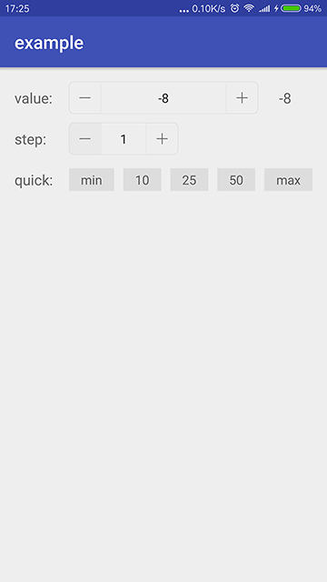

# numberstepper


## Gradle

``` groovy
repositories { 
    maven { url "https://jitpack.io" }
}
```  
    
``` groovy
dependencies {
    compile 'com.github.czy1121:numberstepper:1.0.1'
}
```
    
## Usage
    
**XML**

``` xml
<com.github.czy1121.view.NumberStepper
    android:id="@+id/ns"
    style="@style/NumberStepper"
    app:nsMaxValue="100"
    app:nsMinValue="1"
    app:nsStep="1"
    app:nsValue="5"
    />
```

**Java**

``` java
nsValue = (NumberStepper) findViewById(R.id.np);
nsValue.setOnValueChangedListener(new NumberStepper.OnValueChangedListener() {
    @Override
    public void onValueChanged(NumberStepper view, int value) {
        txtValue.setText("" + value);
    }
});
// init(step, min, max, value)
nsValue.init(5, -10, 100, 8); 
```

## Preview

